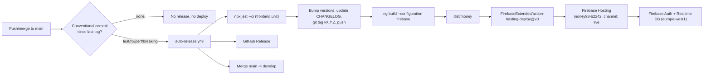
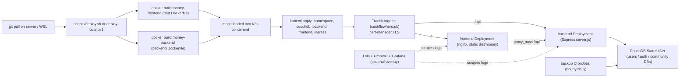

# Architecture

## 1. Repo layout & tooling

- **Single Angular application, not a monorepo.** `angular.json` has exactly one project (`"money"`, `projectType: application`), no `nx.json`, no additional workspace projects. `backend/` is an independent Node/Express service with its own `package.json`/lockfile/`node_modules` — not an Angular workspace member.
- **Angular 20.3.27** core / **20.3.32** CLI (verified live: `npx ng version`). Note: `todo/migration.md` documents an already-completed Angular 15→19 migration plan; the app has since moved past that target to Angular 20 without a corresponding written record — treat `todo/migration.md` as historical, not current.
- **Build tooling**: the new esbuild-based `@angular-devkit/build-angular:application` builder (not the legacy webpack `browser` builder).
- **Test tooling**: Jest via `@angular-builders/jest` + `jest-preset-angular` (not Karma/Jasmine) for the frontend; plain Jest + Supertest for the backend.
- **Package manager**: npm only (`package-lock.json` at root and in `backend/`; no yarn/pnpm lockfiles anywhere). CI and both Dockerfiles use `npm ci`; the frontend needs `--legacy-peer-deps` (likely `@angular/fire`/`@capacitor` peer ranges), the backend does not.
- **Repo root layout**: `src/` (Angular app), `backend/` (Express API), `e2e/` (Playwright, 27 files), `k8s/` (13 Kubernetes manifests), `scripts/` (23 deploy/backup/ops scripts, `.sh` + `.ps1` variants), `docs/`, `config/` (Loki/Promtail config mounted into containers), `templates/`, `todo/` (internal planning documents, several already executed — see `RISKS_AND_QUESTIONS.md`).
- Version `1.12.0` in `package.json`, kept in sync with `backend/package.json` by the auto-release workflow (§2).

## 2. Firebase build & deploy pipeline, end to end

**Build**: `npm run build` / `npm run build:firebase` → `ng build --configuration firebase`. The `firebase` configuration in `angular.json` replaces `src/environments/environment.ts` with `environment.production.ts` (`mode: 'firebase'`, embeds the live Firebase web config — apiKey, `authDomain: money98-b2242.firebaseapp.com`, `databaseURL` in `europe-west1`), sets `outputHashing: all`, optimization on, bundle budgets, and registers the PWA service worker (`ngsw-config.json`). Output: `dist/money`.

**Deploy**: `firebase.json` (`public: dist/money`, SPA rewrite, linked repo `github.com/Djey8/money`) + `.firebaserc` (project `money98-b2242`). Two workflows can deploy, but only one is live:

- **`.github/workflows/auto-release.yml`** — the real, active pipeline. Triggers on push to `main` (self-guards against its own release commits via a `chore(release):` message prefix). Runs frontend Jest → detects a conventional-commit version bump since the last tag → if a bump is warranted: bumps both `package.json`s, regenerates `CHANGELOG.md`, commits as `chore(release): vX.Y.Z`, tags, pushes → builds (firebase config) → deploys via `FirebaseExtended/action-hosting-deploy@v0` (`channelId: live`, service-account secret) → creates a GitHub Release → merges `main` back into `develop`.
- **`.github/workflows/firebase-hosting-merge.yml`** — the CLI-generated original, now `workflow_dispatch`-only; its own comment says deploy is handled by `auto-release.yml`.
- **`.github/workflows/release.yml`** — also dispatch/tag-triggered, guarded to not double-fire; builds + creates a GitHub Release only, no Firebase deploy.

**Concretely**: any push to `main` containing at least one `feat`/`fix`/`perf`/breaking conventional commit since the last tag triggers a fully automatic version bump, build, and live Firebase Hosting deploy — **no manual approval gate**. Commits that are only `chore`/`docs`/etc. push but don't release.

## 3. Self-hosted build & deploy pipeline, end to end

**Frontend build**: `ng build --configuration selfhosted` — replaces `environment.ts` with `environment.selfhosted.ts` (`mode: 'selfhosted'`, `apiUrl: '/api'`, relative so it works behind any domain).

**Container images**: root `Dockerfile` — 2-stage, `node:22-alpine` (pinned by digest) builds `dist/money`, then `nginx:alpine` (pinned digest) serves it on `8080`/`8443`. `backend/Dockerfile` — single-stage `node:22-alpine` (pinned digest) with several manual `apk`/`npm pack` CVE patches, `npm ci --only=production`, non-root user `nodejs:1001`, `EXPOSE 3000`, `HEALTHCHECK` on `/health`.

**nginx.conf**: two server blocks (`8080` HTTP redirecting to HTTPS only behind a TLS-terminating proxy, `8443` HTTPS terminating TLS itself from a k8s secret). Both proxy `/api` to `http://backend:3000` and serve the Angular SPA with fallback routing; CouchDB's Fauxton admin UI is intentionally **not** proxied (must use `kubectl port-forward`).

**Orchestration — Docker Compose** (4 files): `docker-compose.yml` is the minimal production stack (CouchDB 3.3, backend, frontend — 3 containers). `docker-compose.logging.yml` is an optional overlay (Loki 2.9.3 + Promtail 2.9.3 + Grafana 10.2.0) applied on top when debugging. `docker-compose.test.yml` / `docker-compose.e2e.yml` are ephemeral stacks for backend integration tests and Playwright E2E respectively.

**Orchestration — Kubernetes** (`k8s/`, 13 manifests): `namespace.yaml`, `couchdb.yaml` (headless Service + StatefulSet), `backend.yaml` (ConfigMap + Service + Deployment, 1 replica, hardened securityContext, `imagePullPolicy: Never` — expects the image pre-loaded via `ctr images import`), `frontend.yaml` (NodePort 30080/30545, 1 replica), `ingress.yaml` (Traefik + cert-manager/Let's Encrypt, host `cashflowhero.uk`), `network-policy.yaml` (restricts CouchDB ingress to backend + backup jobs), `backup-cronjob-hourly.yaml` / `-daily.yaml` (tiered retention, optional NAS), `loki.yaml` / `promtail.yaml` / `grafana-dashboards*.yaml` (optional logging overlay), `secrets.yaml.example` (template only — real secrets file is gitignored).

**Scripts** (`scripts/`, 23 files): `deploy.sh` / `deploy-local.ps1` are the main entry points (flags for skip-build/skip-tls/skip-backup/preset `--prd`/`--dev`). Supporting scripts cover backup/restore/list-backups, logging stack up/down, e2e/test-env up/down, version-bump/changelog/auto-bump (local equivalents of the CI release logic), Grafana dashboard extraction, and one Firebase-only admin tool (`set-firebase-admin.js`, grants/revokes the Firebase Auth `admin` custom claim).

## 4. "Synced between editions" — reality check

**There is no sync mechanism. Firebase and self-hosted are fully independent islands**, not two views onto shared data:

- Separate builds (different `environment.ts` baked in at compile time via `fileReplacements`), separate databases (Firebase Realtime DB vs. CouchDB), separate identity systems (Firebase Auth vs. self-hosted JWT+bcrypt) with no shared ID space — the same email registered on both editions produces two unrelated accounts.
- `auth.service.ts` / `database.service.ts` branch purely on `if (mode === 'firebase') ... else ...`; the mode is fixed per build with no runtime negotiation, webhook, or replication job connecting the two.
- The **only** bridge is a manual, user-initiated, file-based migration documented in `docs/SELFHOSTED.md`: export a full JSON backup (+ optional encryption key) from the Firebase app's Profile → Export, then upload it via the self-hosted app's Profile → Restore. This is a one-time move, not an ongoing sync, and there is no facility to keep the two in sync afterward.

This directly informs the master prompt's assumption of "what synced between those means today" (§2.1): the answer is **nothing is synced** — they are two independently-deployed products sharing only a codebase, and the master prompt's own hard constraint (Firebase = UI-only, Pro features absent) is actually easier to satisfy than "keep two synced systems separate" would be, since there's no existing sync path to worry about breaking.

## 5. Self-hosted backend inventory

**`backend/server.js`**: Express app — `helmet()`, CORS from `CORS_ORIGINS` env (comma-split, `credentials: true`), two rate limiters (generous global 10,000/15min on `/api/`, bypassable via `SKIP_RATE_LIMIT=true`; strict 10/15min on `/api/auth/{login,register,guest}`), body parsers (JSON 100mb, text/plain 1000mb — sized for large encrypted batch writes/restores; note `docs/SELFHOSTED.md`'s stated "2MB body-parser limit" is stale versus the actual code), `cookie-parser`, request/error logging middleware, optional debug body-logging gated by `DEBUG_REQUESTS`. Mounts routes at `/api/auth`, `/api/data`, `/api/logs`, `/api/community`; `GET /health` is public/unauthenticated.

**`backend/routes/auth.js`** — see §6 for the full authentication flow this implements.

**`backend/routes/data.js`** — the generic per-user JSON blob store (see `FEATURE_CATALOG.md` for the "backend reality check"): `POST /read/batch`, `POST /write/batch`, `POST /write/*?`, `GET /updatedAt`, `GET /read/*?`, `GET /document`, `DELETE /delete/*?`, all behind `authenticateToken`. Batch routes are declared before the wildcard routes specifically to avoid Express wildcard shadowing.

**`backend/routes/community.js`** — the one other real REST surface: `GET /threads` (public), `POST /threads` (auth + 20/5min rate limit), `GET /threads/:id` (public), `POST /threads/:id/posts`, `POST /posts/:id/react` (fixed 6-emoji set, one per user), `PUT /threads/:id` / `PUT /posts/:id` (author or admin), `DELETE /posts/:id` / `DELETE /threads/:id` (author or admin).

**`backend/routes/logs.js`** — `POST /frontend` (auth) ingests batched frontend log entries into Winston/Loki; `GET /health` (public) for the logging pipeline itself.

**`backend/middleware/auth.js`** — `authenticateToken` reads the JWT from the `access_token` httpOnly cookie first, falling back to `Authorization: Bearer`. Distinguishes `TokenExpiredError` (401 + `code: TOKEN_EXPIRED`, signaling the frontend to call `/refresh`) from other invalid-token cases (403). Admin status (`req.isAdmin`) is a comma-separated `ADMIN_EMAILS` env var checked against the token's email claim per request — not a CouchDB role, and used only to gate Community moderation, not app-data access.

**`backend/middleware/logging.js`** — Winston structured logging with response-time flagging (>1000ms) and a security-event webhook (`SECURITY_ALERT_WEBHOOK_URL`) fired for a fixed list of high-severity event types (account lockout, refresh-token reuse, brute force, unauthorized access, data-breach attempt).

**`backend/config/db.js`** — CouchDB connection via `nano` v11, using a manually-built stateless Basic Auth header rather than nano's cookie-session flow (a code comment explains this avoids session-refresh logic for a long-running process, since nano v11 dropped its axios-based auth option). `initializeDatabase()` (run once at startup, skipped under test) creates the `users`/`auth`/`community` databases if missing, builds Mango indexes (`email` on `auth`; `userId` on `users`; compound `type+threadId+createdAt` on `community`), installs a `_design/validation` doc on `users` enforcing `{data: object, createdAt, updatedAt}`, and sets `_security` documents restricting all three databases to the CouchDB service-account admin only — **end users never talk to CouchDB directly**, only through the Express API. No connection pool tuning beyond Node/fetch keep-alive defaults.

**Schema/migrations**: none — CouchDB is fully schemaless. "Schema enforcement" is limited to the one `validate_doc_update` function above and the idempotent Mango-index creation at every startup. There is no migration framework (no Flyway/Liquibase/knex-migrate equivalent) anywhere in the stack.

## 6. Authentication today, per edition

**Firebase**: `AngularFireAuth` (compat API) directly. `checkAuthentication()` awaits `afAuth.authState`, force-refreshes the ID token, and treats a specific set of Firebase error codes (token expired, user disabled/not-found, invalid token, requires-recent-login) as a real logout while treating other errors (e.g. transient network failures) as "still authenticated" to avoid spurious sign-outs. A separate manual CLI tool, `scripts/set-firebase-admin.js`, grants/revokes the Firebase Auth `admin` custom claim (drives Realtime Database security-rule-based moderation access) — there's no route-level equivalent to the self-hosted `ADMIN_EMAILS` mechanism on the Firebase side.

**Self-hosted** (`backend/routes/auth.js` / `middleware/auth.js`):

- **Registration**: email regex, password policy (≥8 chars, upper/lower/digit), uniqueness check via Mango `find` on `auth`, `bcrypt.hash(cost 10)`, user id `user_<timestamp>_<uuid fragment>`, writes credentials to the **`auth`** database and a companion data doc to the **`users`** database.
- **Login**: in-memory (per-process, not shared across replicas) account lockout — 10 consecutive failures locks 15 minutes, counters reset after 30 minutes of inactivity. `bcrypt.compare`.
- **JWT**: `jsonwebtoken`, secret from required `JWT_SECRET` env (no default). Access token `{userId, email}`, 24h expiry. Refresh token `{userId, email, jti}`, 365d expiry, tracked server-side as a revocable `rt_<jti>` document in `auth`. Both delivered as httpOnly cookies (`access_token` path `/`; `refresh_token` path `/api/auth` only), `sameSite: strict`, `secure` only in production.
- **Refresh/rotation**: `POST /refresh` verifies signature+expiry, checks the `rt_<jti>` doc still exists (missing = treated as **reuse**, logged as a high-severity security event, both cookies cleared); on success the old doc is deleted and a fresh pair issued — full rotation on every use. Logout deletes the current `rt_<jti>` doc.
- **Guest identity**: a distinct lower-trust `role: 'guest'` JWT, 180-day expiry, minted by `POST /guest`, used only for anonymous Community posting — never tracked in `auth` (no revocation, no `jti`).
- **Isolation model**: enforced entirely at the Express-route layer — every operation uses `req.userId` (from the verified JWT) as the CouchDB document id; CouchDB itself is locked down at the `_security` level so a compromised or malicious end-user credential still can't reach the database directly.

**This confirms and sharpens the master prompt's §4.3 defaults** (self-developed auth, self-hosted only, per-user document isolation): the refresh-token-rotation-with-server-side-revocation pattern already implemented here is a reasonable model to extend for PAT scopes rather than replace.

## 7. Tests, linting, formatting, CI — current status

**No linter or formatter is configured anywhere in the repo.** No `.eslintrc*`/`eslint.config.*`/`.prettierrc*` at root or in `backend/`; neither `eslint` nor `prettier` is a dependency in either `package.json`. `.editorconfig` exists but isn't enforced by tooling. `lint-staged` (configured in `package.json`) does not lint — it runs targeted Jest tests against changed files. **This is a direct, concrete gap against §3.4 ("make lint, format, type-check runnable with one command each") — there is nothing to wire up yet; a linter has to be chosen and added from scratch, not just exposed via a script.**

**Pre-commit hooks** (`.husky/`): `pre-commit` runs `lint-staged` (test-on-changed-files) then `gitleaks` secret scanning if gitleaks is installed locally (silently skipped otherwise — not a hard gate). `commit-msg` enforces Conventional Commits via regex, which is what makes the automated version-bump detection in `auto-release.yml` possible.

**Test results, run live in this environment:**

- **Frontend**: `npx jest --config jest.config.js --ci` → **73 test suites, 776 tests, all passing** (~6 min wall time). `jest.config.js` sets deliberately low coverage floors (branches 5%, functions 20%, lines/statements 15%) — these are minimum gates, not a coverage target.
- **Backend unit**: `npx jest --forceExit -- tests/unit` → **7 test suites, 69 tests, all passing.**
- Both suites required `npm install`/`npm ci` first — neither `node_modules` was pre-populated in this checkout. Frontend needs `--legacy-peer-deps`; backend does not.

**What CI actually runs** (`.github/workflows/test.yml`, on PRs to `main`):

| Job                   | What it does                                                                                                                                                                                                              |
| --------------------- | ------------------------------------------------------------------------------------------------------------------------------------------------------------------------------------------------------------------------- |
| `frontend-unit`       | `npm ci --legacy-peer-deps` → Jest with coverage artifact upload                                                                                                                                                          |
| `backend-unit`        | Jest against `tests/unit`                                                                                                                                                                                                 |
| `backend-integration` | Jest against `tests/integration`, with a real `couchdb:3` service container                                                                                                                                               |
| `e2e`                 | **Disabled** (`if: false`, comment "Temporarily disabled") — Playwright is fully wired (`docker-compose.e2e.yml`, health-wait, `test:e2e` script, 27-file `e2e/` dir) but not a CI gate today, only runs locally/manually |
| `security-audit`      | `npm audit --omit=dev --audit-level=high`, both packages                                                                                                                                                                  |
| `container-scan`      | Trivy scan of both Docker images, fails on CRITICAL/HIGH                                                                                                                                                                  |
| `secret-scan`         | `gitleaks-action` over full git history                                                                                                                                                                                   |
| `sbom`                | SPDX SBOM generation for both packages                                                                                                                                                                                    |

No dedicated lint job exists — consistent with there being no linter configured. This CI setup is otherwise notably mature (audit, container scan, secret scan, SBOM all wired up) — see `RISKS_AND_QUESTIONS.md` for how this reconciles with the "no linter" and "no PLAN.md yet" gaps.

## Diagrams

See the Mermaid diagrams in §2 and §3 above for the Firebase and self-hosted deployment flows respectively.
